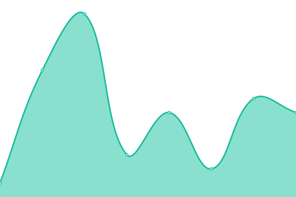
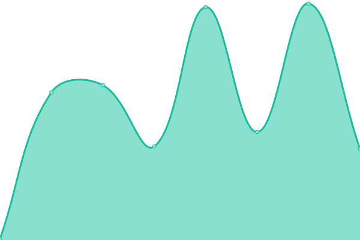

# [📈 Live Status](https://dxrf.com): <!--live status--> **🟩 All systems operational**

This repository contains the open-source uptime monitor and status page for [James Massardo](http://www.dxrf.com), powered by [Upptime](https://github.com/upptime/upptime).

With [Upptime](https://upptime.js.org), you can get your own unlimited and free uptime monitor and status page, powered entirely by a GitHub repository. We use [Issues](https://github.com/jmassardo/upptime/issues) as incident reports, [Actions](https://github.com/jmassardo/upptime/actions) as uptime monitors, and [Pages](https://dxrf.com) for the status page.

<!--start: status pages-->
<!-- This summary is generated by Upptime (https://github.com/upptime/upptime) -->
<!-- Do not edit this manually, your changes will be overwritten -->
<!-- prettier-ignore -->
| URL | Status | History | Response Time | Uptime |
| --- | ------ | ------- | ------------- | ------ |
|  [DXRF](http://dxrf.com) | 🟩 Up | [dxrf.yml](https://github.com/jmassardo/upptime/commits/HEAD/history/dxrf.yml) | 

 101ms
     
 | 

<a href="https://jmassardo.github.io/upptime/history/dxrf">100.00%</a>
    

|  [DXRF - SSL](https://dxrf.com) | 🟩 Up | [dxrf-ssl.yml](https://github.com/jmassardo/upptime/commits/HEAD/history/dxrf-ssl.yml) | 

 5ms
     
 | 

<a href="https://jmassardo.github.io/upptime/history/dxrf-ssl">100.00%</a>
    

|  [Massardo Electronics](http://massardoelectronics.com) | 🟩 Up | [massardo-electronics.yml](https://github.com/jmassardo/upptime/commits/HEAD/history/massardo-electronics.yml) | 

 105ms
     
 | 

<a href="https://jmassardo.github.io/upptime/history/massardo-electronics">100.00%</a>
    

|  [Massardo Electronics - SSL](https://massardoelectronics.com) | 🟩 Up | [massardo-electronics-ssl.yml](https://github.com/jmassardo/upptime/commits/HEAD/history/massardo-electronics-ssl.yml) | 

 142ms
     
 | 

<a href="https://jmassardo.github.io/upptime/history/massardo-electronics-ssl">100.00%</a>
    

|  [Massardo Family](http://massardofamily.com) | 🟩 Up | [massardo-family.yml](https://github.com/jmassardo/upptime/commits/HEAD/history/massardo-family.yml) | 

 94ms
     
 | 

<a href="https://jmassardo.github.io/upptime/history/massardo-family">100.00%</a>
    

|  [Massardo Family - SSL](https://massardofamily.com) | 🟩 Up | [massardo-family-ssl.yml](https://github.com/jmassardo/upptime/commits/HEAD/history/massardo-family-ssl.yml) | 

 132ms
     
 | 

<a href="https://jmassardo.github.io/upptime/history/massardo-family-ssl">100.00%</a>
    

|  [KD5JAG](http://kd5jag.info) | 🟩 Up | [kd-5-jag.yml](https://github.com/jmassardo/upptime/commits/HEAD/history/kd-5-jag.yml) | 

 183ms
     
 | 

<a href="https://jmassardo.github.io/upptime/history/kd-5-jag">100.00%</a>
    

|  [KD5JAG - SSL](https://kd5jag.info) | 🟩 Up | [kd-5-jag-ssl.yml](https://github.com/jmassardo/upptime/commits/HEAD/history/kd-5-jag-ssl.yml) | 

 134ms
     
 | 

<a href="https://jmassardo.github.io/upptime/history/kd-5-jag-ssl">100.00%</a>
    

|  [FRC5730](http://www.frc5730.com) | 🟩 Up | [frc-5730.yml](https://github.com/jmassardo/upptime/commits/HEAD/history/frc-5730.yml) | 

 208ms
     
 | 

<a href="https://jmassardo.github.io/upptime/history/frc-5730">100.00%</a>
    

|  [FRC5730 - SSL](https://www.frc5730.com) | 🟩 Up | [frc-5730-ssl.yml](https://github.com/jmassardo/upptime/commits/HEAD/history/frc-5730-ssl.yml) | 

 142ms
     
 | 

<a href="https://jmassardo.github.io/upptime/history/frc-5730-ssl">100.00%</a>
    

|  [The FRC Pros](http://www.thefrcpros.com) | 🟩 Up | [the-frc-pros.yml](https://github.com/jmassardo/upptime/commits/HEAD/history/the-frc-pros.yml) | 

 124ms
     
 | 

<a href="https://jmassardo.github.io/upptime/history/the-frc-pros">100.00%</a>
    

|  [The FRC Pros -](https://www.thefrcpros.com) | 🟩 Up | [the-frc-pros.yml](https://github.com/jmassardo/upptime/commits/HEAD/history/the-frc-pros.yml) | 

 124ms
     
 | 

<a href="https://jmassardo.github.io/upptime/history/the-frc-pros">100.00%</a>
    

<!--end: status pages-->

[**Visit our status website →**](https://dxrf.com)

## 📄 License

- Powered by: [Upptime](https://github.com/upptime/upptime)
- Code: [MIT](./LICENSE) © [James Massardo](http://www.dxrf.com)
- Data in the `./history` directory: [Open Database License](https://opendatacommons.org/licenses/odbl/1-0/)
